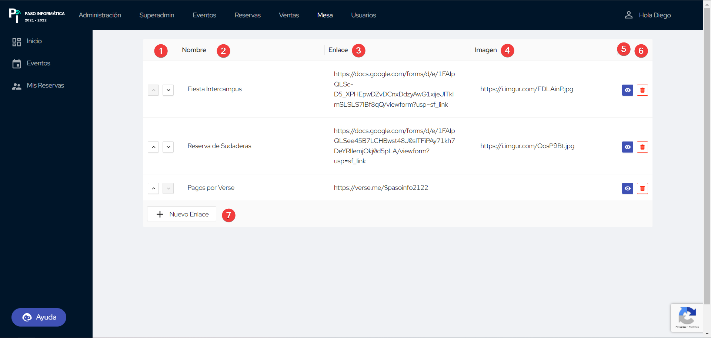

# Gestión de Enlaces

La gestión de enlaces afecta a los enlaces que hay visibles en la página de inicio:

<figure markdown>
  
  <figcaption>Enlaces</figcaption>
</figure>

## Visualizar todos los enlaces

En la página de gestión de enlaces se verá algo tal que así:

<figure markdown>
  
  <figcaption>Gestión de Enlaces</figcaption>
</figure>

Los elementos que se muestran son:

1. Nombre del enlace
2. Enlace en cuestión
3. Imagen (opcional) del enlace
4. Cambiar de visible a oculto, y viceversa
5. Eliminar enlace
6. Crear nuevo enlace

## Crear un nuevo enlace

Para **crear un nuevo enlace**, basta con hacer clic en el botón **`Nuevo Enlace`**, y se creará automáticamente un
enlace con las siguientes características:
- **Nombre**: _Enlace_
- **Enlace**: _https://reservas.pasoinfo.xyz_
- **Imagen**: Ninguna
- **Oculto**

Si se quieren cambiar estos parámetros basta con editarlo.

## Eliminar un enlace

Para eliminar un enlace, basta con hacer **clic en el icono de la basura** y se eliminará permanentemente. Será
independiente si el enlace está visible u oculto.

## Editar un enlace

La tabla con los enlaces es una **tabla "interactiva"** de tal forma que si se clica en alguna de las tres columnas se
convertirá en editable. Hay que tener en cuenta un detalles a la hora de editar las columnas, y es que al acabar de
editarlo hay que pulsar <kbd>Enter</kbd> para aplicar los cambios. 

Para editar la visibilidad basta con clicar en el botón correspondiente (en **azul oscuro indica que está visible**).

## F.A.Q.

!!! question "¿Se puede usar cualquier imagen?"
    Sí, con tal de que sea accesible publicamente y con una extensión compatible con la web.
