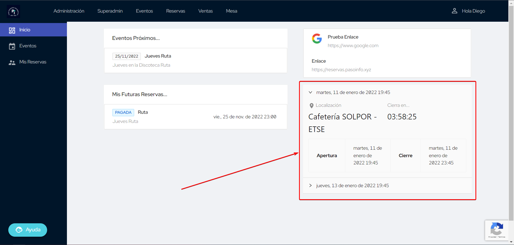
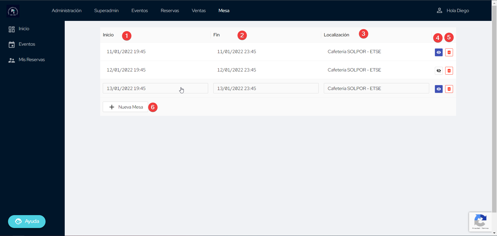
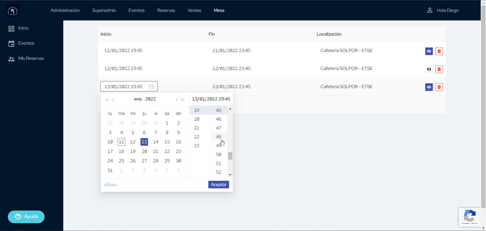

# Gestión de Mesas

La gestión de las mesas permite cambiar la lista de Mesas del Paso en la página de inicio:

<figure markdown>
  
  <figcaption>Mesas</figcaption>
</figure>

Cabe destacar que en la página de inicio solo se mostrarán las mesas que estén marcadas como visible y no estén
cerradas una hora más allá de la hora actual.

## Visualizar todas las Mesas

En la página de administración de las Mesas, se verá algo tal que así:

<figure markdown>
  
  <figcaption>Gestión de Mesas</figcaption>
</figure>

Los elementos que se muestran son:

1. Fecha de apertura de la Mesa
2. Fecha de cierre de la Mesa
3. Ubicación de la Mesa
4. Si la Mesa está visible o no
5. Eliminar la Mesa definitivamente
6. Crear una nueva Mesa

## Crear una nueva Mesa

Para **crear una nueva Mesa**, basta con hacer clic en el botón **`Nueva Mesa`**, y se creará automáticamente una Mesa con
las siguientes características:

- **Fecha de apertura**: ahora mismo
- **Fecha de cierre**: 4 horas adelante
- **Localización**: _Cafetería SOLPOR - ETSE_
- **Oculta**

Si se quieren cambiar estos parámetros basta con editarla.

## Eliminar una Mesa

Para eliminar una Mesa, basta con hacer **clic en el icono de la basura** y se eliminará permanentemente. Será
independiente si la Mesa está visible, oculta y ya se completó.

Hay una función por detrás que eliminará las Mesas cuya fecha de cierre cumpla 4 horas.

## Editar una Mesa

La tabla con las Mesas es una **tabla "interactiva"** de tal forma que si se clica en alguna de las tres columnas se
convertirá en editable. Hay que tener en cuenta un par de detalles a la hora de editar las columnas.

En la **edición de fechas** el primer clic convertirá la fecha en editable, y el segundo abrirá el selector de fecha
para hacer la edición más sencilla:

<figure markdown>
  
  <figcaption>Edición de Fechas</figcaption>
</figure>

Y a la hora de editar cualquier campo, se deberá de clicar <kbd>Enter</kbd> para confirmar el guardar del campo.

Para editar la visibilidad basta con clicar en el botón correspondiente (en **azul oscuro indica que está visible**).

## F.A.Q.

!!! question "¿Se puede desactivar el borrado automático de las mesas?"
    No, por ahora no es posible.

!!! question "¿Se pueden mostrar Mesas que ya hayan cerrado?"
    Se mostraran mesas ya cerradas con una tolerancia de 1 hora, siempre y cuando estén marcadas como visible.

!!! question "¿Cómo puedo cambiar el orden de las Mesas?"
    El orden en el que se muestran las Mesas en la pantalla de inicio ya está predefinido. Se muestran ordenadas por
    la fecha de apertura, de la más próxima a la más lejana. Es independiente del orden en el que se muestren en el
    panel de administración.
