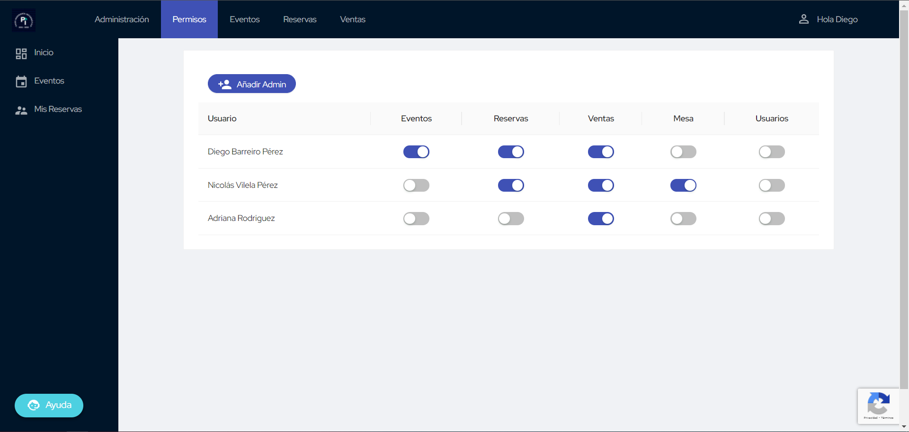

# Sistema de Permisos

En esta página encontrarás toda la información necesaria sobre la jerarquía de permisos en
SiResU. Hay una serie de permisos asignados a diferentes roles, cada uno con acceso a ciertas
acciones concretas.

!!! info "Departamentos"
    El Paso de Informática se organiza en Departamentos. Cada Departamento tiene un coordiandor,
    pero los integrantes del departamento pueden estar en varios departamentos.  
    Es por esto que el sistema de permisos no siempre va a tener una equivalencia 1:1 con estos
    departamentos.

Todos los administradores tienen acceso a la página principal del panel de administración. Esta
está alojada en [/admin](https://reservas.pasoinfo.xyz/admin/).

## Superadmin

Este es un permiso especial que no se puede otorgar desde la propia interfaz web. No tiene
ninguna referencia visual, pero permite a los que lo posean gestionar el resto de permisos.

<figure markdown>
  
  <figcaption>Gestión de Permisos</figcaption>
</figure>

Un superadmin no puede quitarle el permiso de superadmin a otro superadmin, ni asignar nuevos
superadmins. Pero sí que pueden asignar otros admins con permisos normales, y retirárselos.

## Permisos

### Eventos

- [ ] Departamento de Eventos Deportivos
- [ ] Departamento de Fiestas
- [ ] Departamento de Reservas

### Reservas

- [x] Departamento de Reservas
- [ ] Departamento de Ventas

### Ventas

- [x] Departamento de Ventas
- [x] Departamento de Tesorería
- [ ] Departamento de Reservas

### Mesa

- [x] **Departamento de Redes Sociales**
- [ ] **Departamento de Reservas**
- [ ] **Departamento de Ventas**

### Usuarios

- [x] _Nadie_
