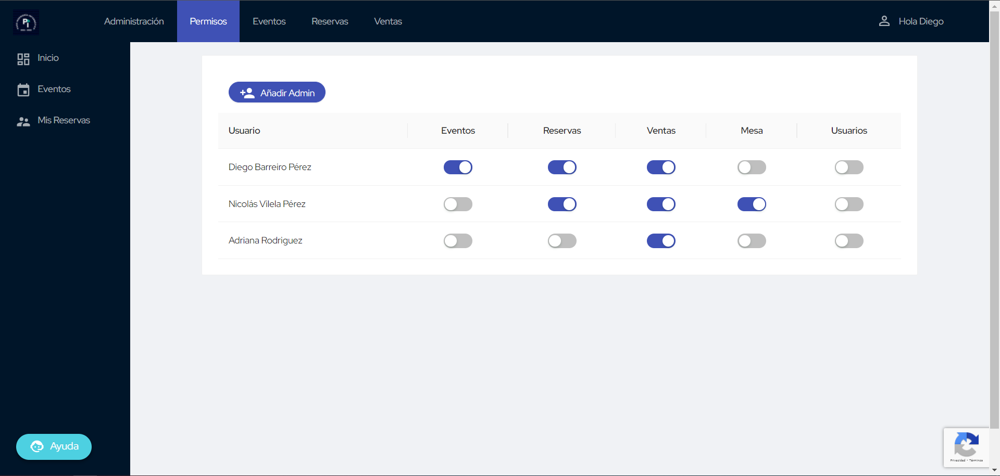

# Sistema de Permisos

En esta página encontrarás toda la información necesaria sobre la jerarquía de permisos en
SiResU. Hay una serie de permisos asignados a diferentes roles, cada uno con acceso a ciertas
acciones concretas.

!!! info "Departamentos"
    El Paso de Informática se organiza en Departamentos. Cada Departamento tiene un coordiandor,
    pero los integrantes del departamento pueden estar en varios departamentos.  
    Es por esto que el sistema de permisos no siempre va a tener una equivalencia 1:1 con estos
    departamentos.

Todos los administradores tienen acceso a la página principal del panel de administración. Esta
está alojada en [/admin](https://reservas.pasoinfo.xyz/admin/).

??? danger "Registro de Acciones"
    Todos los cambios de estado de cualquier reserva o asistente quedan registrados. Se almacena
    tanto el propio admin que realiza la acción, como los estados anteriores y futuros de la reserva
    o asistente.

## Superadmin

Este es un permiso especial que no se puede otorgar desde la propia interfaz web. No tiene
ninguna referencia visual, pero permite a los que lo posean **gestionar el resto de permisos**.

[Gestión de Permisos](https://reservas.pasoinfo.xyz/admin/superadmin/){ .md-button .md-button--primary }

<figure markdown>
  
  <figcaption>Gestión de Permisos</figcaption>
</figure>

Un superadmin no puede quitarle el permiso de superadmin a otro superadmin, ni asignar nuevos
superadmins. Pero sí que pueden asignar otros admins con permisos normales, y retirárselos.

## Permisos

!!! example "Leyenda"
    - [x] _Todos los miembros el Departamento tienen el permiso_
    - [ ] _Sólo el Coordinador del Departamento tiene el permiso_

Para entender mejor el funcionamiento de los permisos, se recomienda leer antes el
[Proceso de Reserva](../proceso.md) para saber como se desarrolla internamente.

### Eventos

- [ ] Departamento de Eventos Deportivos
- [ ] Departamento de Fiestas
- [ ] Departamento de Reservas

[Gestión de Eventos](https://reservas.pasoinfo.xyz/admin/eventos/){ .md-button .md-button--primary }

Este permiso permite realizar la gestión de los eventos. Esto extiende **desde la creación de los
propios eventos, hasta la vinculación con Google Forms, apertura de respuestas, y otras
configuraciones de los propios eventos**. Aún así, este permiso no da acceso a la gestión de las
reservas de los propios eventos, ni a las ventas.

Se podrá ver una lista con todos los eventos, sobre la que se puede filtrar por fechas. Clicando
en alguna fila, se irá a la página de gestión de este evento.

### Reservas

- [x] Departamento de Reservas
- [ ] Departamento de Ventas

[Gestión de Reservas](https://reservas.pasoinfo.xyz/admin/reservas/){ .md-button .md-button--primary }

Los administradores que tengan este permiso tendrán la responsabilidad de gestionar las reservas.
El propio sistema tiene la posibilidad de realizar asignaciones de entradas automáticamente, pero
es posible realizarlas manualmente. Se permite sobrepasar los límites de entradas totales, pero
saltarán avisos en caso de que se vaya a hacer.

Se puede **asignar, confirmar y cancelar cualquier reserva** desde este panel. Estas acciones deberán
ser acordes con los ajustes del evento; es decir, si un evento requiere entradas nominativas,
para confirmar se deberán especificar todos los asistentes.

### Ventas

- [x] Departamento de Ventas
- [x] Departamento de Tesorería
- [ ] Departamento de Reservas

[Gestión de Ventas](https://reservas.pasoinfo.xyz/admin/ventas/){ .md-button .md-button--primary }

El permiso de gestión de ventas es el encargado de realizar las ventas de las entradas confirmadas.
Se debe tener en cuenta que, si una reserva confirmada tiene 3 entradas, aparecerán 3 entradas en
la lista (una por asistente). Además, si una entrada está asociada a una reserva, se podrán ver
los detalles de la reserva.

Se podrá **marcar como pagada una entrada, como entregada en caso de tener entradas físicas (y hasta
indicar la referencia de la entrada física) y cancelar la entrada**. Además, se permitirá realizar
ventas sin reserva (mostrando un aviso si se va a sobrepasar el límite de entradas totales).

### Mesa

- [x] Departamento de Redes Sociales
- [ ] Departamento de Ventas

[Gestión de Mesa](https://reservas.pasoinfo.xyz/admin/mesa/){ .md-button .md-button--primary }

El nombre de este permiso, a pesar de ser _Mesa_, podría ser _Varios_, ya que engloba a varios
aspectos del sistema.

Por una parte, permite **gestionar el listado de las horas de mesa y sus ubicaciones que hay
visibles** en la página principal. Además, permite **gestionar los enlaces adicionales** que hay
esta página de inicio a otras webs externas a SiResU.

### Usuarios

- [ ] _Nadie_

[Gestión de Usuarios](https://reservas.pasoinfo.xyz/admin/usuarios/){ .md-button .md-button--primary }

Este permiso está pensado para administradores del sistema, para **permitir acceder a todos los
datos y acciones de los perfiles** salvo el cambio de contraseña.

Por ejemplo, cuando se busque un usuario, se permitirá ver todos sus detalles al completo, en vez
de sólo las iniciales de nombre y apellidos.
